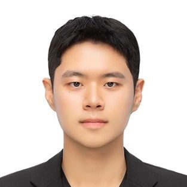

  
  
  <h1>Yoonseong Jeong</h1>

  

    <b>Senior Undergraduate Student @ KAIST, School of Computing</b> 
    <i>Exploring the mathematical foundations of Generative AI & General Intelligence</i>
  

  
  

    
  

  

  
  

  
  
  

### 

My goal is to understand the essence of intelligence through mathematical and biological lenses.

* **Generative Models**   Discrete Diffusion Language Models (DLMs), Score-based Generative Models.
* **Neuroscience & AGI**   Bridging Brain Science (Neural Dynamics) and Artificial General Intelligence.
* **Mathematical Foundations**   Information Geometry, Sampling Theory (DPM-Solver).

 

### 

**Big Data Analytics and Learning (BigDyL) @ KAIST**
* *Advisor: Prof. Noseong Park*
* **Topic:** Sampler Acceleration for Diffusion Language Models using Riemannian Geometry.
* **Details:** Investigated geometric structures of discrete data manifolds to design efficient sampling algorithms for DLMs.

**Brain x Machine Intelligence Lab (BMI Lab) @ KAIST**
* *Advisor: Prof. Sang Wan Lee*
* **Topic:** Decoding Cognitive States via Deep Neural Experimenter.
* **Details:** Visualized attention maps to analyze subject's cognitive decoding process. Studied the dynamics of cognitive states under One-shot and Incremental learning conditions.

<b>Pre-University Research Projects</b>

 
<ul>
  <li>Mathematical modeling of epidemic spread (COVID-19).</li>
  <li>Analysis of viscous coefficients via floating body motion between fluids.</li>
  <li>Acoustic conversion analysis of periodic shockwaves.</li>
  <li>Design of dynamic protection mechanisms for falling objects.</li>
</ul>

 

### 

* **AI & Data** : Deep Learning, Machine Learning, Database Systems.
* **Systems & Theory** : Operating Systems, Programming Languages, Probability & Statistics.
* **Neuroscience** : Theoretical Neuroscience, Biology of Neurons, Statistics for Brain Science.

 

### 

  
  
  
  
   
  
  
  
  

 

### 

I find inspiration in classical literature and philosophical discourse.

* **Philosophy** — Kant (*Critique of Pure Reason*), Nietzsche, Camus, Foucault.
* **Literature** — *The Sorrows of Young Werther*, *The Stranger*, *Siddhartha*, *The Judgment*, *Status Anxiety*.

 

---
