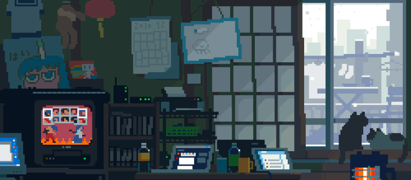

<h1 align="center"><b>Hi there, I'm Yoonseong Jeong<b/> </h1>

  

### 👨🏻‍💻 &nbsp;About Me

<!--  -->

🤖 I'm a sophomore on kaist with a passion for AI, DataScience   
📖 I enjoy reading a book and love JAZZ  
💎 I'm always eager to learn new things and take on exciting challenges.

<h3 align="left">⚙️&nbsp;My GitHub Stats</h3>

<h2></h2>
<h3 align="center">🛠&nbsp;Tech Stack</h3>

  

<h3 align="center">💽&nbsp;Using OS</h3>

  

### 🤝🏻 &nbsp;Contact Me

  
  
  

